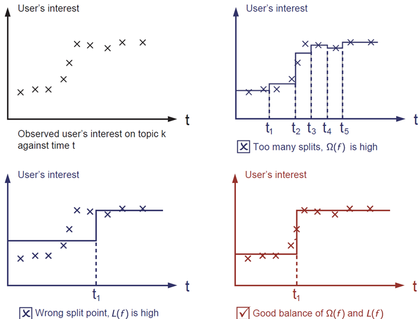
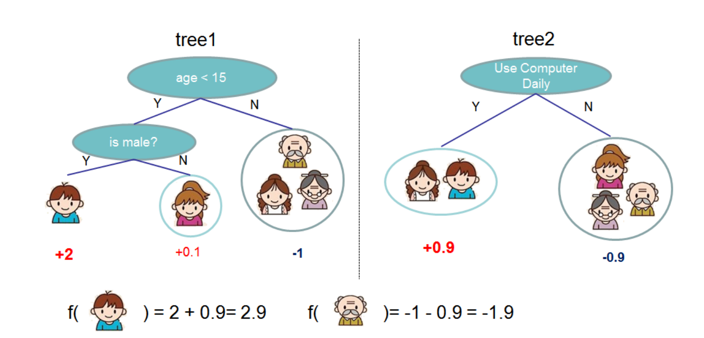

```{r setup, include=FALSE}
knitr::opts_chunk$set(echo = TRUE)
```

This is a tutorial on classification trees and boosted trees, based on LOH Wei-yin's
review article on [Classification and regression trees](http://www.stat.wisc.edu/~loh/treeprogs/guide/wires11.pdf),
Scott Fortmann-Roe's article on [Bias-Variance Trade-off](http://scott.fortmann-roe.com/docs/BiasVariance.html)
and CHEN Tianqi's [XGBoost: A Scalable Tree Boosting System](https://arxiv.org/pdf/1603.02754.pdf). 

We will discuss basic ideas, as well as implementation details.

# Classification Trees

Classification and regression trees are machine-learning methods for constructing
prediction models from data. The models are obtained by recursively partitioning
the data space and fitting a simple prediction model within each partition. As a
result, the partitioning can be represented graphically as a decision tree. Classification
trees are designed for dependent variables that take a finite number
of unordered values, with prediction error measured in terms of misclassification
cost. Regression trees are for dependent variables that take continuous or
ordered discrete values, with prediction error typically measured by the squared
difference between the observed and predicted values. 


## How large should a tree be grown?

You can always keep on splitting with binary nodes until you get 0 error.
However, fitting a very complex tree (as with any other model) is not a good idea.



The basic principles of model selection is that the more complex a model is, the higher the variance 
your trained model will be, because the randomness in the training data manifests in the fitting process.

The simpler your model is, the more constrained the model is. A simpler model has little room to wiggle
and twist to fit the training data. There lies the possibility of bias, in that the model may be insufficient
to describe the truth.

A good model should be a good trade-off between bias and vairance: not too complicated, but not to overly-simplified.


There are ways that people have came up to perform model selection, many of them based on the same idea, and
summarize the trade-off in a number that is of the form "bias + variance".

We resort to cross validation in model choices in this tutorial. It is an automatic, and easy-to-understand strategy
that we discussed in the last tutorial.

Cross-validation is built-in in the package `rpart`, which we will be using in the next section.

## An example

Let's illustrate this with an example, and try to understand the output.

```{r}
head(iris)

library(rpart)
(fit <- rpart(Species ~ ., data = iris, method = "class"))
summary(fit) # detailed summary of splits
plotcp(fit) # visualize cross-validation results 
printcp(fit) # display the results 

# install.packages("rpart.plot")
library(rpart.plot)
rpart.plot::prp(fit, extra = 101, fallen.leaves = T)
```

Let's look at the result of the splits visually

```{r}
plot(iris[,3:4], col = as.numeric(iris$Species), pch = as.numeric(iris$Species))
abline(v = 2.45); lines(c(2.45, 8), c(1.75, 1.75), lty = 2)
```

## Lending Club data

Now the real data. We fit a classification tree to the Lending Club Loan data.

```{r}
# Classification Tree with rpart
library(rpart)
# Read data
LCdata <- read.csv("../data/LoanStatsTraining.csv", header = T)
```

```{r}
LCdata$isBadLoan <- as.factor(LCdata$isBadLoan)
# grow tree 
fit <- rpart(isBadLoan ~ sub_grade + dti + loan_amnt,
  	method = "class", data = LCdata)

summary(fit) # detailed summary of splits
```

There is only one split, why?

Remember this is an unbalanced dataset, the default criteria for making splits weighs two classes equally. We need to specify the relative weights. 

```{r}
# grow tree 
fit <- rpart(isBadLoan ~ sub_grade + dti + loan_amnt, weights = 1 + (isBadLoan == 1) * 4, 
  	method = "class", data = LCdata, control = rpart.control(cp = 0.002))

# summary(fit) # detailed summary of splits
plotcp(fit)

rpart.plot::prp(fit, extra = 101, fallen.leaves = T)
```

Notice that the cross-validation error actually increases when the number of terminal nodes increases (we set the termination criteria to be cp = 0.002). We have over-fitted to the data. CV error shows that the optimal split is when termination criteria is at cp = 0.02.

Let's re-fit the tree using the optimal value from cross-validation

```{r}
# grow tree 
fit <- rpart(isBadLoan ~ sub_grade + dti + loan_amnt, weights = 1 + (isBadLoan == 1) * 4, 
  	method = "class", data = LCdata, control = rpart.control(cp = 0.02))

summary(fit) # detailed summary of splits
rpart.plot::prp(fit, extra = 101, fallen.leaves = T)
```

It seems that the best tree grown out of the three co-variates is just a one-split decision.

# Forest

Bagging and other resampling techniques can be used to reduce the variance in model predictions. In bagging (**B**ootstrap **Agg**regat**ing**), numerous replicates of the original data set are created using random selection with replacement. Each derivative data set is then used to construct a new model and the models are gathered together into an ensemble. To make a prediction, all of the models in the ensemble are polled and their results are averaged.

One powerful modeling algorithm that makes good use of bagging is Random Forests. Random Forests works by training numerous decision trees each based on a different resampling of the original training data. In Random Forests the bias of the full model is equivalent to the bias of a single decision tree (which itself has high variance). By creating many of these trees, in effect a "forest", and then averaging them the variance of the final model can be greatly reduced over that of a single tree. In practice the only limitation on the size of the forest is computing time as an infinite number of trees could be trained without ever increasing bias and with a continual (if asymptotically declining) decrease in the variance.

## Details

Every time we draw 63.2\% of all the samples (the expected number of distinct items in a bootstrap sample, or otherwise specified by the user), and `mtry` number of co-variates (chosen by the user), and perform the same tree fitting procedure `ntree` times (500, or otherwise specified by the user).

Each tree provides a prediction (clsasification / regression) for the samples chosen.

The final prediction is taken as the aggregated votes (in classification) or average predicted value (in regression).

## Illustration with `iris`

```{r}
# install.packages("randomForest")
library(randomForest)
```

```{r}
?randomForest
(fitForest <- randomForest(Species ~ ., data = iris, mtry = 4))
importance(fitForest)
varImpPlot(fitForest)
```

Most of the splits that generate a big gain (in terms of [Gini impurity](https://en.wikipedia.org/wiki/Decision_tree_learning#Gini_impurity)) 
is made on the `Petal.Width` and `Petal.Length` variables, They show up as the most important variables for categorization of the Spiecies.


We can look at a sample of the predictions

```{r}
(fitForest$votes[100:110,])
```

Some of them are classified with high probability into one of the groups,
some of them are less clear (but still very close to 0/1).
The classes in this example is well-seperated.

# Boosted trees

Another idea to aggregate trees is Boosting.

Rather than fitting trees in parallel, we start with a tree that is fitted on all the data.
In the next iteration we focus on the samples that were misclassified in the last round.

For example if we wish to predict if a user likes computer games, the first tree grown (tree1)
splits on age and gender, and terminates. However, mistakes are made on some of the samples, 
e.g. the old senior citizen, who actually like video games, were misclassified. 
Then in the next round of fitting, we try to make that right by placing more weights on the miscalssified samples.



We will follow [the official tutorial on XGboost] (http://xgboost.readthedocs.io/en/latest/R-package/xgboostPresentation.html) together.


